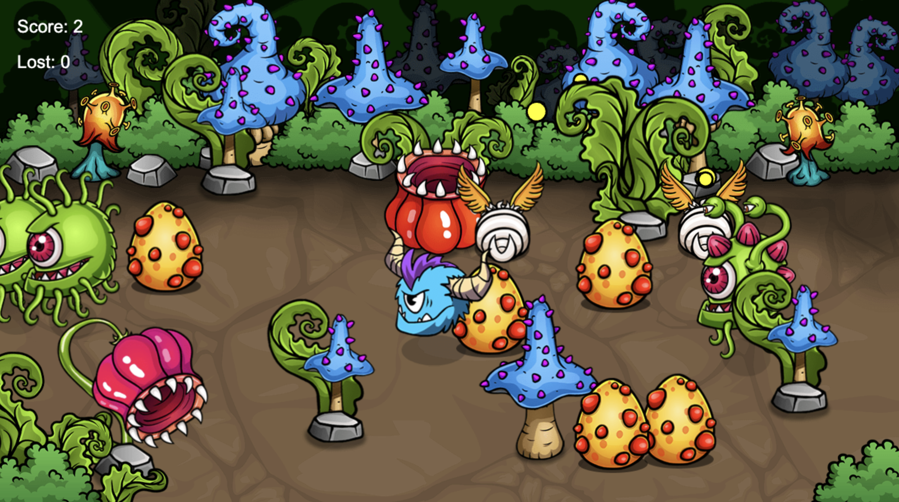

# Game Tutorial Project

This project is based on a YouTube tutorial that guides you through the fundamentals of game development using HTML, CSS, and JavaScript.

You can find the initial video on the [Free Code Camp Youbube](https://www.youtube.com/watch?v=U34l-Xz5ynU).

## Overview

The goal of the tutorial is to create a simple game that includes various assets such as images and a canvas element to render the game graphics.

## Features

- Player movement mechanics
- Enemy variations
- Particle effects
- Basic sphere physics and collision detection

## License

This project is licensed under the MIT License. See the LICENSE file for more details.

## Contact

For any questions or feedback, please reach out to [arcadie.dev](https://arcadie.dev).
